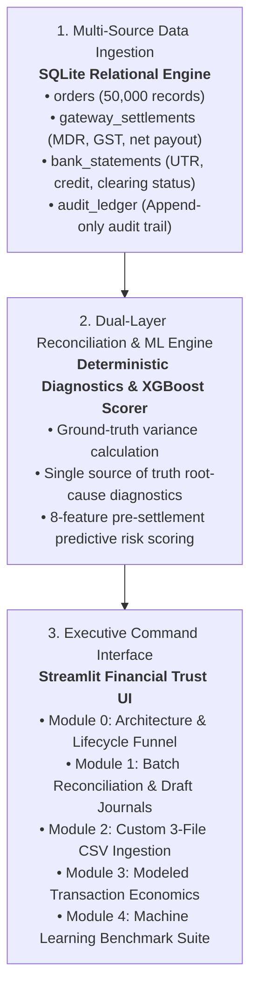

# LedgerMind AI — Multi-Source 3-Way Reconciliation & Resolution Engine

[](https://ledgermind-ai-1766.streamlit.app/)
[](https://www.python.org/downloads/)
[](https://opensource.org/licenses/MIT)

---

## 1. What Problem Does LedgerMind AI Solve?

In high-volume digital payments and e-commerce, transaction records are fragmented across three separate systems:
1. **Source 1: Merchant Internal Orders DB** — What the customer purchased and the payment method used (e.g., UPI, Credit Card).
2. **Source 2: Payment Gateway Feed (e.g., Razorpay)** — What the gateway processed, deducting contracted MDR fees, configured 18% GST benchmarks, and temporary escrow holds.
3. **Source 3: Bank Realization Statements** — What cash was actually credited into the merchant's bank account with a confirmed UTR reference.

### The Real-World Bottleneck
Payment reconciliation between these three sources is often done manually via spreadsheets days or weeks after settlement. This leads to hidden discrepancies:
* **MDR Rate Overcharges:** Gateway charges 2.6% instead of the contracted 1.9%.
* **GST Miscalculations:** Tax lines computed at 28% rather than the configured 18% benchmark.
* **Gateway Escrow Holds:** Funds marked `ON_HOLD` by risk engines without immediate visibility.
* **Unrealized Bank Credits & Shortfalls:** Gateway marks a transaction `SETTLED`, but the bank deposit is missing, delayed, or short.

### The LedgerMind AI Solution
**LedgerMind AI** automates this end-to-end reconciliation and resolution process:
* **Deterministic 3-Way Join:** Fast relational matching across Orders, Gateway Settlements, and Bank Statements.
* **Root-Cause Diagnostic Engine:** Automatically categorizes exceptions (`MDR Overcharge`, `GST Mismatch`, `Settlement On Hold`, `Unrealized Bank Credit`, `Bank Amount Shortfall`, `Missing Gateway Record`, `Invalid Financial Data`) and computes exact leakage.
* **Predictive ML Risk Prioritization:** Scores transactions using an independent **8-feature XGBoost model** trained on checkout signals available before downstream settlement feeds arrive.
* **Draft Accounting Journal Proposals:** Generates balanced double-entry journal entries (`DR 1140 Gateway Receivable / CR 5120 Fee Expense / CR 2210 GST Input Tax`) for finance team review.
* **API-Ready Dispute Payloads:** Formats structured JSON dispute packets ready for payment gateway dispute endpoints.

---

## 2. Transaction Lifecycle & Reconciliation Funnel

The relational database models a realistic payment lifecycle across 50,000 synthetic transactions:

| Funnel Stage | Record Count | Percentage | Operational Meaning |
|---|---|---|---|
| **Total Ingested Orders** | 50,000 | 100.0% | Customer checkout attempts in merchant database |
| **Failed / Declined** | 972 | 1.94% | Payment declined at acquiring bank or OTP stage |
| **Refunded Orders** | 513 | 1.03% | Order cancelled/returned, capital refunded to customer |
| **Successful Orders** | 48,515 | 97.03% | Completed customer checkouts sent to Gateway |
| **Gateway Escrow Holds** | 1,276 | 2.55% | Payout delayed by Gateway risk/compliance engines |
| **Cleared Bank Deposits** | 47,239 | 94.48% | Net cash cleared in merchant bank account with UTR |

---

## 3. System Architecture & Workflow



### Application Modules:

* **Module 0: 3-Way System Architecture & Data Funnel**  
  Visual walkthrough of money flow between Merchant, Gateway, and Bank. Includes a live schema inspector querying the SQLite tables.

* **Module 1: Multi-Source Batch Verification & Resolution Workflows**  
  Executes relational 3-way joins across dynamic batch sizes (50 to 48,515 records), runs active XGBoost anomaly scoring, isolates the Honest Exception List with root causes, and generates balanced double-entry journal proposals and API-ready dispute JSON payloads.

* **Module 2: Custom 3-File CSV Multi-Source Ingestion**  
  Enables evaluators to upload three independent raw CSV files (`orders.csv`, `gateway_settlements.csv`, `bank_statements.csv`) or download sample templates. Performs schema validation, mounts an in-memory SQLite database, runs 3-way matching, evaluates ML risk scores, and outputs diagnostic root causes.

* **Module 3: Financial Stress & MDR Scenario Simulator**  
  Illustrative payment-mix scenario model to explore how changes in Credit Card MDR rates (0.5% to 3.5%), UPI volume share (20% to 80%), and escrow hold rates affect modeled transaction economics.

* **Module 4: Machine Learning Benchmark & Zero-Leakage Pipeline**  
  Documents the Scikit-learn preprocessing pipeline and presents a multi-model benchmark under realistic imbalanced class distribution (~9.8% anomaly rate).

---

## 4. Machine Learning Design & Benchmark

### Dual-Layer Architecture: Reconciliation Truth vs. Predictive Prioritization
* **Deterministic Reconciliation Engine:** Determines actual financial exceptions based on contractual MDR rates, configured 18% GST rules, and bank realization statements.
* **Machine Learning Model:** Acts as an independent pre-settlement risk scorer that prioritizes transaction queues using checkout signals available before downstream settlement feeds arrive.

### 8 Standard Business Features (Zero Feature Leakage)
To prevent feature leakage, direct settlement outcomes (such as `actual_fee_charged`, `gst_charged`, or `fee_variance`) are excluded from the model. The model is trained strictly on standard checkout signals:
1. `order_amount`: Raw transaction checkout amount in INR.
2. `log_amount`: Log-transformed transaction value (`log1p`).
3. `payment_method`: One-hot encoded payment instrument (`UPI`, `Credit Card`, `Debit Card`, `Net Banking`).
4. `merchant_category`: One-hot encoded business segment (`Gaming`, `Travel`, `Electronics`, `SaaS`, `Retail`, `Utilities`).
5. `contract_mdr_rate`: Contractual merchant discount rate baseline.
6. `order_hour`: Timestamp hour of day (0 to 23).
7. `is_high_value`: High-value transaction indicator (`order_amount > 10,000`).
8. `category_risk_prior`: Configured category risk prior by merchant sector.

### Multi-Model Benchmark Results (Held-Out Synthetic Test Set)

| Model Architecture | ROC-AUC | PR-AUC (Baseline: 0.0980) | Precision | Recall | F1-Score | Role |
|---|---|---|---|---|---|---|
| **XGBoost (Selected Production Model)** | **0.8059** | **0.3459** (**3.53x Lift**) | **0.2367** | **70.2%** | **0.3541** | Primary Risk Scorer |
| **Random Forest Ensemble** | **0.8061** | **0.3412** (**3.48x Lift**) | **0.2458** | **66.9%** | **0.3595** | Tree Ensemble Baseline |
| **Logistic Regression** | **0.8135** | **0.3436** (**3.51x Lift**) | **0.2389** | **73.0%** | **0.3600** | Linear Baseline |
| **Gradient Boosting** | **0.8171** | **0.3590** (**3.66x Lift**) | **0.6170** | **6.1%** | **0.1110** | High Precision Baseline |

*Methodology Note: Performance is evaluated on held-out synthetic transactions generated under the same data-generating assumptions.*

---

## 5. Draft Accounting Journal Proposals & Chart of Accounts

When exceptions are processed in Module 1, LedgerMind AI drafts balanced double-entry accounting proposals for finance review:

| Account Code | Account Name | Account Type | Normal Balance | Usage in Resolution |
|---|---|---|---|---|
| **1140** | Gateway Settlement Receivable | Current Asset | Debit | Overcharged fees, held funds, and uncredited deposits claimable from gateway |
| **5120** | Merchant Processing Fee Expense | Operating Expense | Credit (Reversal) | Deduction reversal for excess MDR processing fees |
| **2210** | GST Input Tax Credit (ITC) | Current Asset / Liability | Credit (Reversal) | Tax line reversal for over-assessed GST |
| **2050** | Gateway Escrow Suspense Clearing | Current Liability | Credit | Balancing suspense entry for funds held in gateway escrow |
| **1090** | Bank Inflow Clearing Suspense | Current Asset | Credit | Balancing suspense entry for unrealized bank credits or clearing shortfalls |
| **1145** | Unsettled Merchant Order Clearing | Current Asset | Debit | Holding account for merchant orders unacknowledged by gateway |
| **4010** | Sales Revenue Suspense | Revenue Suspense | Credit | Balancing entry for unconfirmed merchant order revenue |

*Every proposed journal entry is arithmetically balanced (`Total Debits == Total Credits == Leakage Amount`).*

---

## 6. Database Schema Specification

```sql
-- 1. Orders Table (Merchant Primary DB)
CREATE TABLE orders (
    order_id VARCHAR(32) PRIMARY KEY,
    customer_id VARCHAR(32),
    order_amount DECIMAL(12,2),
    order_timestamp TIMESTAMP,
    payment_method VARCHAR(24),
    merchant_category VARCHAR(32),
    order_status VARCHAR(16)
);

-- 2. Gateway Settlements Table (Payment Gateway Feed)
CREATE TABLE gateway_settlements (
    settlement_id VARCHAR(32) PRIMARY KEY,
    order_id VARCHAR(32) REFERENCES orders(order_id),
    gateway_txn_id VARCHAR(32) UNIQUE,
    gross_amount DECIMAL(12,2),
    contract_mdr_rate DECIMAL(6,4),
    actual_fee_charged DECIMAL(12,2),
    gst_charged DECIMAL(12,2),
    net_settlement_amount DECIMAL(12,2),
    settlement_status VARCHAR(16),
    settlement_timestamp TIMESTAMP
);

-- 3. Bank Statements Table (Bank Realization Feed)
CREATE TABLE bank_statements (
    bank_txn_id VARCHAR(32) PRIMARY KEY,
    gateway_txn_id VARCHAR(32) REFERENCES gateway_settlements(gateway_txn_id),
    utr_number VARCHAR(32) UNIQUE,
    credit_amount DECIMAL(12,2),
    bank_timestamp TIMESTAMP,
    clearing_status VARCHAR(16)
);

-- 4. Audit Ledger Table (Resolution & Journal Audit Trail)
CREATE TABLE audit_ledger (
    audit_id INTEGER PRIMARY KEY AUTOINCREMENT,
    order_id VARCHAR(32) REFERENCES orders(order_id),
    anomaly_type VARCHAR(32),
    leakage_amount DECIMAL(12,2),
    ai_confidence REAL,
    root_cause_explanation TEXT,
    action_taken TEXT,
    timestamp TIMESTAMP DEFAULT CURRENT_TIMESTAMP
);
```

---

## 7. Local Installation & Setup Guide

### Prerequisites
- Python 3.9 or higher
- Git

### 1. Clone the Repository
```bash
git clone https://github.com/Arunpurohit1766/Ledgermind-AI.git
cd Ledgermind-AI
```

### 2. Install Dependencies
```bash
pip install -r requirements.txt
```

### 3. Launch the Application
```bash
python -m streamlit run app.py
```

The application will launch in your browser at `http://localhost:8501`.

---

## 8. Technology Stack

- **Frontend & Interface:** Streamlit (Financial Trust Design System, Obsidian Dark theme)
- **Database Engine:** SQLite Relational Database Engine (In-process, sub-millisecond query execution)
- **Machine Learning:** Scikit-Learn Pipeline (`ColumnTransformer`, `StandardScaler`, `OneHotEncoder`), XGBoost, Random Forest, Joblib
- **Data Manipulation & Analytics:** Pandas, NumPy

---

## 9. Project & Submission Details

* **Project Name:** LedgerMind AI
* **Submission Track:** Track 04 — AI Finance Controller (Razorpay AI Buildathon 2026)
* **Author:** Arun J
* **Degree / Branch:** B.Tech Computer Science & Engineering (Artificial Intelligence & Data Science)
* **Institution:** Swarnim Startup & Innovation University (SSIU), Ahmedabad
* **Year of Graduation:** July 2029
* **Email:** `arunj.data1766@gmail.com`
* **GitHub Profile:** [https://github.com/Arunpurohit1766](https://github.com/Arunpurohit1766)
* **GitHub Repository:** [https://github.com/Arunpurohit1766/Ledgermind-AI](https://github.com/Arunpurohit1766/Ledgermind-AI)
* **Live Streamlit Cloud Application:** [https://ledgermind-dqkoh6evcwqlkkatlfajjj.streamlit.app/](https://ledgermind-ai-1766.streamlit.app/)
